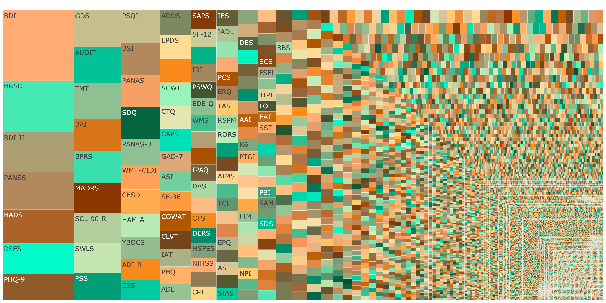
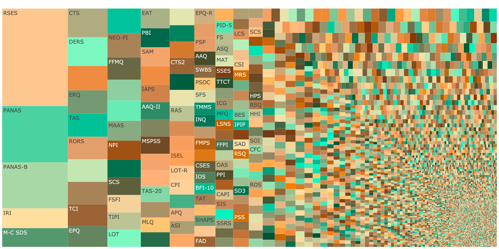
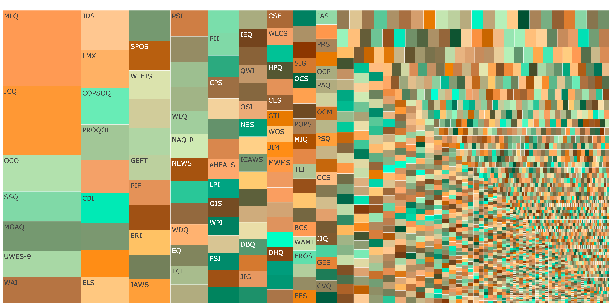
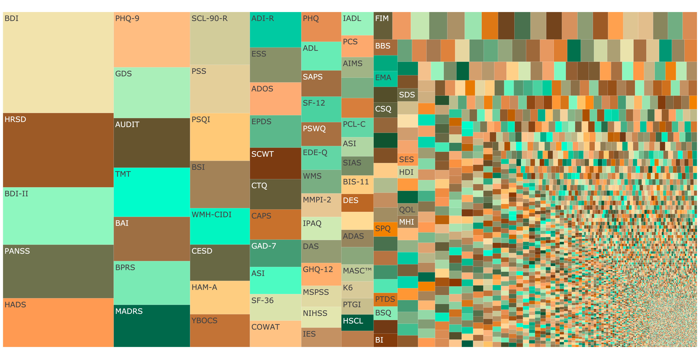
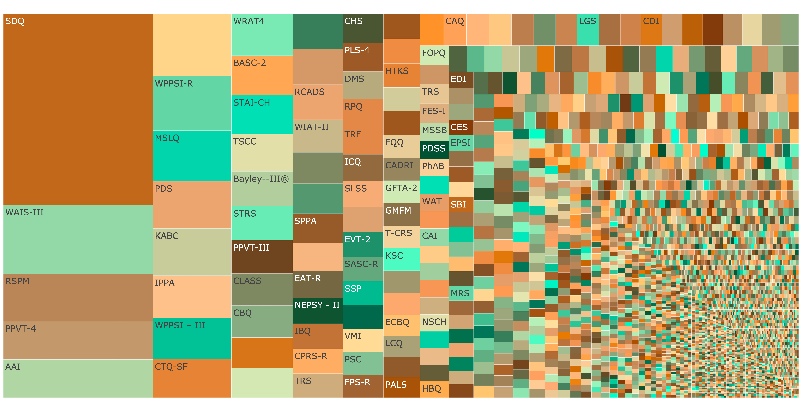
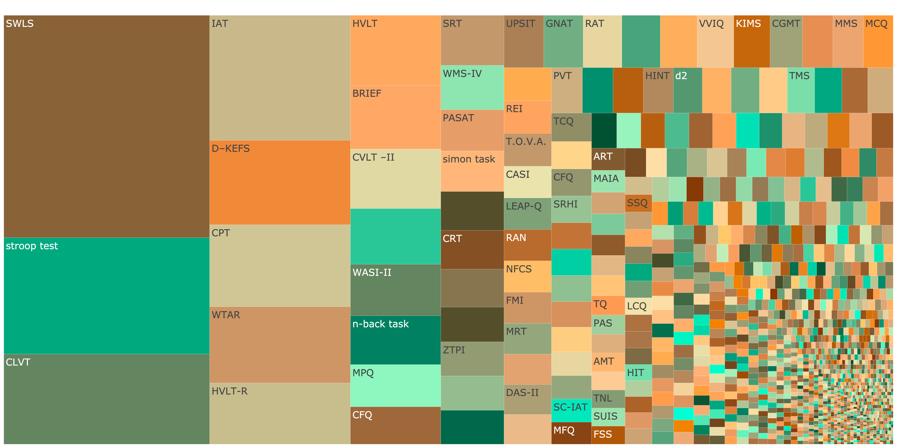

```{css, echo=FALSE}
d-title h1 {
    font-size: 20px;
  }
```

```{r setup, include=FALSE}
knitr::opts_chunk$set(echo = TRUE, error = T, warning = F, message = F)

library(groundhog)
groundhog.library(c("tidyverse", "entropy", "ggrepel", "cowplot", "knitr", "readr",
                    "RColorBrewer", "plotly", "gglorenz", "rio", "hrbrthemes"), 
                  date = "2024-02-24")
theme_set(theme_minimal(base_size = 14))

source("0_functions.R")

psyctests_info <- readRDS("../sober_rubric/raw_data/psyctests_info.rds")
records_wide <- readRDS("../sober_rubric/raw_data/preprocessed_records.rds")
psyctests_info <- psyctests_info %>% 
  left_join(records_wide %>% select(DOI, Acronym = first_acronym), by = "DOI") %>% 
  mutate(shortName = coalesce(Acronym, Name))

tests <- psyctests_info %>% 
  group_by(DOI, shortName, Name) %>%  
  summarise(n = sum(usage_count, na.rm = T),
            parent = "") %>% 
  ungroup() %>% 
  arrange(runif(n()))

entropy = entropy(tests$n)
norm_entropy = calc_norm_entropy(tests$n)
```


```{r layout='l-screen-inset',echo=FALSE,out.width='100%',fig.cap = sprintf("Treemap showing fragmentation across subfields. Normalized Shannon entropy $\\eta(X) = %.2f$ <br>Click image to open interactive plot.", norm_entropy),fig.link="3_fragmentation_overall.html"}

```

This online supplement accompanies our [preprint](https://osf.io/preprints/psyarxiv/b4muj). The main figures for the preprint are [generated here](4_proliferation.html).

The plots you see here on this page are called treemap plots. In such plots, the area per test is proportional to its usage frequency. The images here are static. If you click them, you
can view an interactive plot (give it some time to load) that will allow you to see how often each measure has been used according to APA PsycInfo, and look up the measure in APA PsycTests.

By comparing across the subdisciplines, we can see what higher and lower entropy fields look like visually. High entropy is seen as great fragmentation, i.e. there are many small tiles and many tiles of similar size. Lower fragmentation is apparent when some large tiles reflecting individual measures, such as the Beck Depression Inventory, dominate a field.


```{r}
tests <- psyctests_info %>% 
  filter(subdiscipline_1 == "Personality and Social Psychology") %>% 
  group_by(DOI, shortName, Name) %>% 
  summarise(n = sum(usage_count, na.rm = T),
            parent = "")
norm_entropy = calc_norm_entropy(tests$n)
```


## Personality and Social Psychology
```{r layout='l-screen-inset',out.width='100%',fig.cap = "Treemap showing fragmentation across personality and social psychology. Click image to open interactive plot.", fig.link="3_fragmentation_personality.html"}

```


```{r}
tests <- psyctests_info %>%
  filter(subdiscipline_1 == "Industrial/Organizational Psychology") %>%
  group_by(DOI, shortName, Name) %>%
  summarise(n = sum(usage_count, na.rm = T),
            parent = "")

norm_entropy = calc_norm_entropy(tests$n)
```


## Industrial/Organizational Psychology
### Normalized Shannon entropy `r sprintf("$\\eta(X) = %.2f$", norm_entropy)`
```{r layout='l-screen-inset',out.width='100%',fig.cap = "Treemap showing fragmentation across industrial/organizational psychology. Click image to open interactive plot.", fig.link="3_fragmentation_io.html"}

```


```{r}
tests <- psyctests_info %>%
  filter(subdiscipline_1 == "Health and Clinical Psychology") %>%
  group_by(DOI, shortName, Name) %>%
  summarise(n = sum(usage_count, na.rm = T),
            parent = "")

norm_entropy = calc_norm_entropy(tests$n)
```


## Health and Clinical Psychology
### Normalized Shannon entropy `r sprintf("$\\eta(X) = %.2f$", norm_entropy)`
```{r layout='l-screen-inset',out.width='100%',fig.cap = "Treemap showing fragmentation across Health and Clinical Psychology. Click image to open interactive plot.", fig.link="3_fragmentation_clinical.html"}

```


```{r}
tests <- psyctests_info %>%
  filter(subdiscipline_1 == "Educational and Developmental Psychology") %>%
  group_by(DOI, shortName, Name) %>%
  summarise(n = sum(usage_count, na.rm = T),
            parent = "")

norm_entropy = calc_norm_entropy(tests$n)
```


## Educational and Developmental Psychology
### Normalized Shannon entropy `r sprintf("$\\eta(X) = %.2f$", norm_entropy)`
```{r layout='l-screen-inset',out.width='100%',fig.cap = "Treemap showing fragmentation across Educational and Developmental Psychology. Click image to open interactive plot.", fig.link="3_fragmentation_educational.html"}

```

```{r}
tests <- psyctests_info %>%
  filter(subdiscipline_1 == "Cognitive Psychology") %>%
  group_by(DOI, shortName, Name) %>%
  summarise(n = sum(usage_count, na.rm = T),
            parent = "")

norm_entropy = calc_norm_entropy(tests$n)
```


## Cognitive Psychology
```{r layout='l-screen-inset',out.width='100%',fig.cap = "Treemap showing fragmentation across Cognitive Psychology Click image to open interactive plot.", fig.link="3_fragmentation_cognitive.html"}

```

